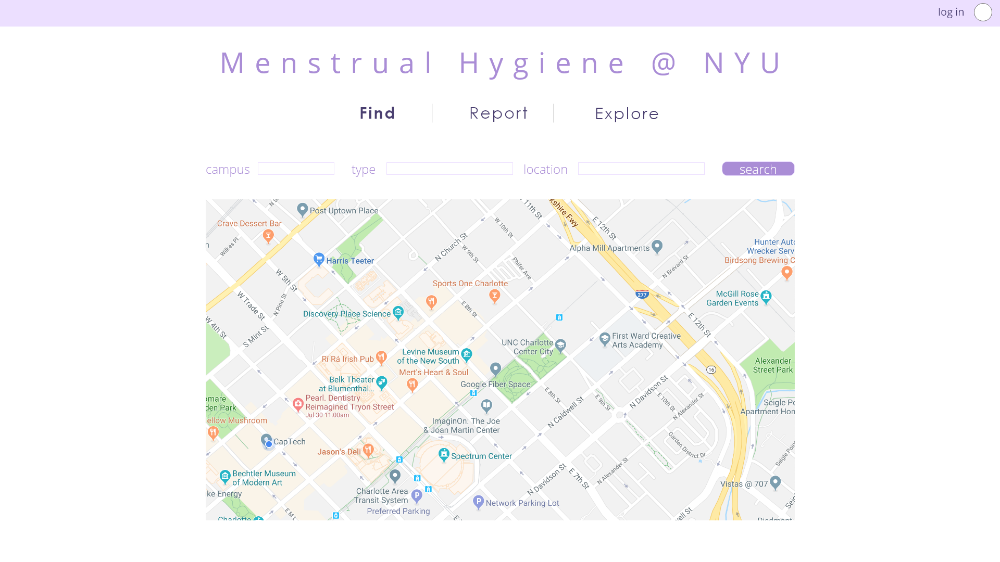
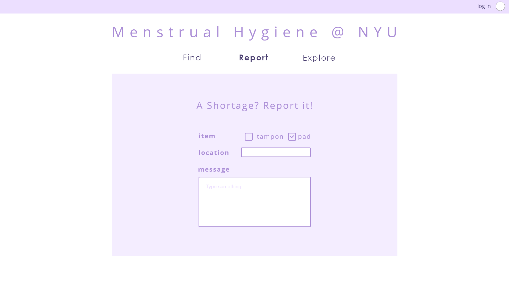
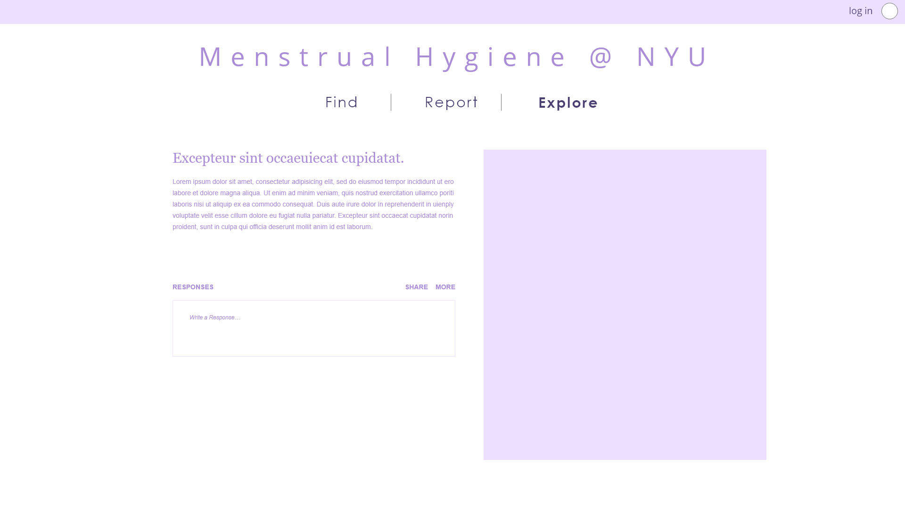
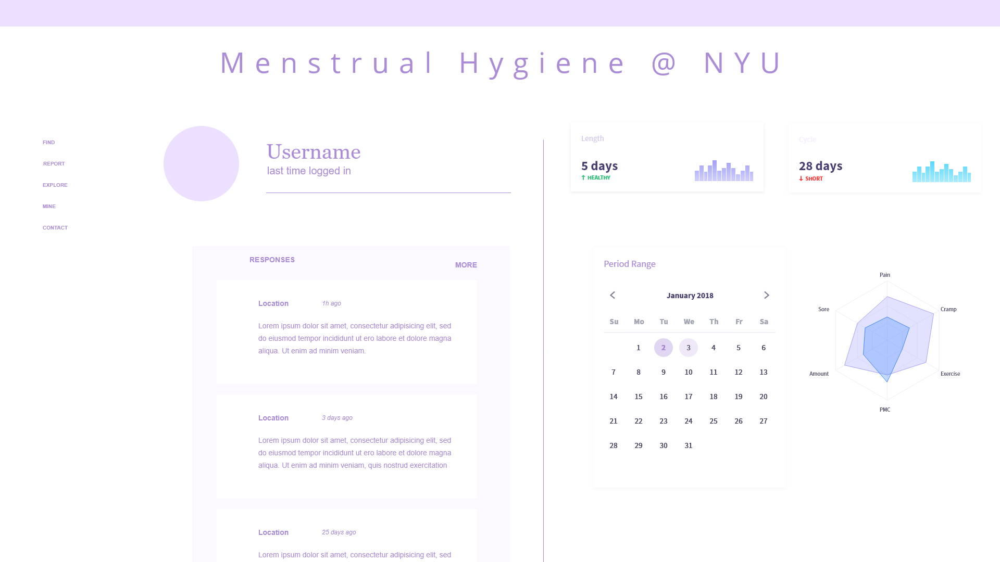
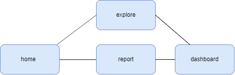

# Menstrual Hygiene @ NYU

## Overview

After a petition in fall 2016 lead by the all-university group Students for Sexual Respect, NYU began providing free menstrual hygiene products in certain restrooms around the Washington Square and Brooklyn campuses. The availability of these products began as a pilot program on October 2016 and the program started running at full capacity in February 2017. Nevertheless, a few limitations of the current implementation have emerged. 

1. Lack of An Accurate Listing of Supply Locations  
   The NYU Menstrual Hygiene Products web page on the Student Health Center website does not list consistent information about where free menstrual hygiene products can be found on campus. 
  
2. Inconsistent availability / Lagging refill of the products  
   While the stock of menstrual hygiene products in all NYU restrooms should be checked by Facilities and Operations custodial staff on their regular cleaning cycle, which rotates several times per day, the reality is reporting empty dispensaries is an added task to existing work duties, and dispensaries are not always refilled immediately.

Mentrual Hygiene @ NYU is a web app that is designed with the general goal to further promote the menstrual hygiene and sexual respect. The main purpose is to allow students to keep track of the free menstrual hygiene supplies by NYU and make reports for inavailabilty. The web application will further extend from NYU to both an individual level, allowing users to keep track of their menstrual health, and a global level,  providing users with information about menstrual hygiene management, pariticularly among girls in poverty. 

Reference:
* https://www.nyu.edu/students/health-and-wellness/services/healthy-living/health-information-library/menstrual-health/menstrual-hygiene-products.html
* https://nyunews.com/2018/02/19/02-20-news-womenshealth/


## Data Model

The application will store Locations, Reports, Users, Admins 

* each report provides information about the supply status at each location (via reference)
* each location includes information about the particular service, price, and current supply
* each user includes information about their menstruation cycle, the reports they have filed (via reference)
* each admin can manage the reports and update the information about the menstrual hygiene products at each location


An Example Report:

```javascript
{
  campus: // WSQ or BRK
  location: // a reference to a location object
  message: "Hi there is no more tampon available at Bobst SOS", 
  item: // the product in shortage
  createdAt: // timestamp
}
```

An Example Location:

```javascript
{
  name: // the location name
  code: // a shortened version
  lat: // the latitude (x coordinator)
  lng: // the longitude (y coordinator)
  type: // either 'take only what you need for now'（immediate) or 'take supplies for later' (future)
  campus: // WSQ or BRK
  items: [
    { name: "tampons", shortage: false, free: false},
    { name: "pads", shortage: false, free: false},
  ],
}
```

An Example User:

```javascript
{
  username: " student health center",
  password: // a password hash,
  report: // a reference to a report object
}
```


## Wireframes

/ - home page for viewing the availability 



/add - page for filing the report



/explore - page for listing all the reports



/me - dashboard for viewing all my reports and menstruation records



## Site map



## User Stories or Use Cases

1. as a non-registered user, I can register a new account with the site
2. as a non-registered user, I can see all the locations where there are available products 
3. as a non-registered user, I can have access to information about menstrual health and relative organization
4. as a user, I can log in to the site
5. as a user, I can see all the locations where there is a certain type of available product
6. as a user, I can file report for unavailable supplies
7. as a user, I can view my past reports and it status
8. as a user, I can revoke my past reports
9. as a user, I can log in information about my menstrual cycle
10. as a user, I can view my past records of menstruations
11. as an admin, I can view all the reports
12. as an admin, I can address/revoke all the reports


## Annotations / References Used

1. [documentation for express-validator.js](https://express-validator.github.io/docs/)
2. [sources and documentations for D3 modules](https://github.com/d3/d3/blob/master/API.md)
3. [tutorial on Google Maps JavaScript API ](https://developers.google.com/maps/documentation/javascript/tutorial)
